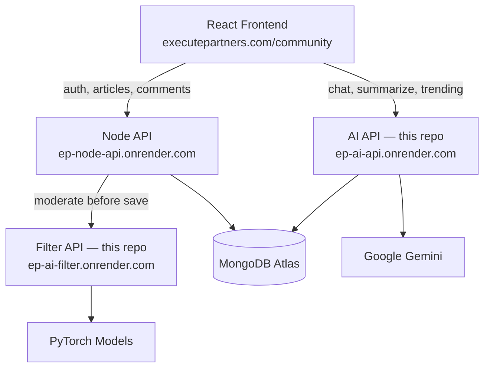

# ExCom Community AI

**Nancy jain** · Execute Partners  
**Live:** [executepartners.com/community](https://www.executepartners.com/community)

I built the AI and content moderation layer for ExCom — Execute Partners' professional community platform. The source code lives in [`execute-partners-backend/`](execute-partners-backend/) — a unified Gemini API and PyTorch moderation pipeline. The React frontend and Node backend run separately in production; links below show how everything connects end-to-end.

---

## Live demo

| | |
|---|---|
| **Community app** | [executepartners.com/community](https://www.executepartners.com/community) |
| **AI API** (this repo) | [ep-ai-api.onrender.com](https://ep-ai-api.onrender.com) |
| **API docs** | [ep-ai-api.onrender.com/docs](https://ep-ai-api.onrender.com/docs) |
| **Filter API** (this repo) | [ep-ai-filter.onrender.com](https://ep-ai-filter.onrender.com) |
| **Node API** | [ep-node-api.onrender.com](https://ep-node-api.onrender.com) |

---

## What's in this repo

All code is in **[`execute-partners-backend/`](execute-partners-backend/)**. I consolidated what used to be **6+ separate AI microservices** into two services:

| Service | Folder | What it does |
|---------|--------|--------------|
| **AI API** | [`execute-partners-backend/ai/`](execute-partners-backend/ai/) | Chat, summarize, trending, title & article generation (Gemini) |
| **Filter API** | [`execute-partners-backend/filter/`](execute-partners-backend/filter/) | Toxicity + identity-hate moderation (PyTorch) |

The Node backend and React frontend are not included here — they're separate production codebases. I link to their live URLs above so reviewers can see the full system working together.

---

## How the system fits together



A few design choices I'm particularly proud of:

- The **browser calls my AI API directly** for Gemini features — lower latency, independent scaling.
- **Moderation always runs server-side** through Node → Filter. The filter is never exposed to the client.
- I migrated production from **8 Render services down to 3** (Node + AI + Filter), with the frontend on Vercel.

More detail in [execute-partners-backend/docs/INTEGRATION.md](execute-partners-backend/docs/INTEGRATION.md) and [execute-partners-backend/docs/ARCHITECTURE.md](execute-partners-backend/docs/ARCHITECTURE.md).

---

## API overview

Base URL: `https://ep-ai-api.onrender.com`

| Method | Endpoint | Purpose |
|--------|----------|---------|
| GET | `/health` | Health check |
| GET | `/trending` | Top articles by engagement score |
| POST | `/chat` | AI assistant & article-writing workflow |
| POST | `/summarize` | Article or comment summary |
| POST | `/generate_title` | Title suggestions |
| POST | `/generate_article` | Guided article drafting |

The filter API at `https://ep-ai-filter.onrender.com` exposes `POST /filtercomment` — Node calls it on every article and comment before saving to MongoDB.

Full reference: [execute-partners-backend/docs/API.md](execute-partners-backend/docs/API.md) · Try it: [Swagger UI](https://ep-ai-api.onrender.com/docs)

---

## Project structure

```
Execute_AI/
├── execute-partners-backend/    ← source code (start here)
│   ├── ai/                      # FastAPI + Gemini
│   ├── filter/                  # Flask + PyTorch moderation
│   │   └── models/
│   ├── docs/
│   ├── docker-compose.yml
│   └── .env.example
├── LICENSE
└── README.md
```

---

## Running locally

```bash
git clone https://github.com/nancyjain779/Execute_AI.git
cd Execute_AI/execute-partners-backend
cp .env.example .env
# Add your GOOGLE_API_KEY

docker compose up --build
```

| URL | Service |
|-----|---------|
| http://localhost:8000/docs | AI API |
| http://localhost:7860/health | Filter API |

Model weights are bundled in `filter/models/` so no Hugging Face download is needed for local runs.

---

## Tech stack

| | |
|---|---|
| AI API | Python, FastAPI, Google Gemini 2.0 Flash, MongoDB |
| Filter API | Python, Flask, PyTorch, Hugging Face Transformers, Docker |
| Production frontend | React, Vite, Tailwind (Vercel) |
| Production Node API | Express, MongoDB, Socket.io (Render) |
| Deployment | Render + Vercel + MongoDB Atlas |

---

## Screenshots

The live community app is the best way to see the product in action: [executepartners.com/community](https://www.executepartners.com/community)

Key features to explore there:
- **Trending topics** chart in the community sidebar
- **Execute AI** modal — summarize articles or ask questions
- **Article creation** with AI-generated title suggestions
- **Comment moderation** running silently via the filter pipeline

---

## Background

I built this while at Execute Partners with employer approval to share as a portfolio piece. Production credentials and the Node/React codebases are not included — only the AI services I owned.

**© Execute Partners** · Portfolio use permitted.
