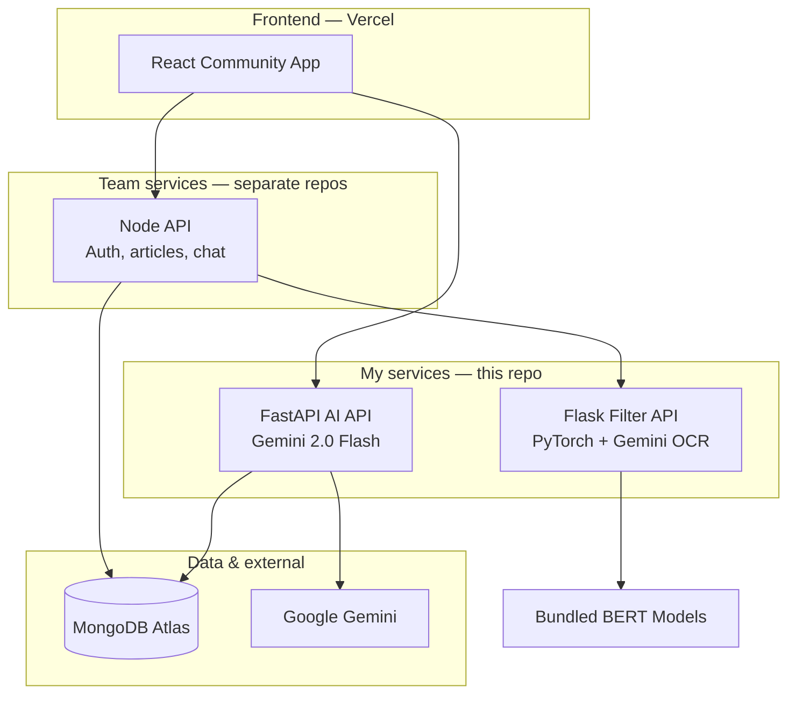

# Architecture

Overview of the ExCom community platform architecture and where my services fit.

**Live:** [executepartners.com/community](https://www.executepartners.com/community)

---

## Production layout



---

## Service responsibilities

| Service | Port (local) | Owner | Role |
|---------|--------------|-------|------|
| AI API | 8000 | Me | Chat, summarize, trending, title/article generation |
| Filter API | 7860 | Me | Toxicity + identity-hate moderation |
| Node API | 5000 | Team | Auth, articles CRUD, Socket.io, filter proxy |
| React app | 5173 | Team | Community UI |

---

## Why two API URLs from the browser

| URL | Purpose |
|-----|---------|
| `VITE_AI_API_URL` | My Gemini endpoints — called directly for speed |
| `VITE_API_URL` | Node — auth, articles, comments, chat |

Moderation never goes browser → filter. Node enforces it on every article and comment.

---

## Migration outcome

| Before | After |
|--------|-------|
| 8 Render services | 3 (Node + AI + Filter) |
| 6+ Python AI microservices | 1 unified FastAPI app |
| Hardcoded API URLs in React | Env-based config on Vercel |

---

## Local development

```bash
cp .env.example .env
docker compose up --build
```

This repo's `docker-compose.yml` runs my AI + filter services with a local MongoDB container. For the full UX, use the [live community app](https://www.executepartners.com/community).

| URL | Service |
|-----|---------|
| http://localhost:8000/docs | AI API Swagger |
| http://localhost:7860/health | Filter API |

---

## Security

- All API keys via environment variables
- CORS restricted in production via `ALLOWED_ORIGINS`
- Filter enforced server-side on all user-generated content
- No production secrets in this repository
