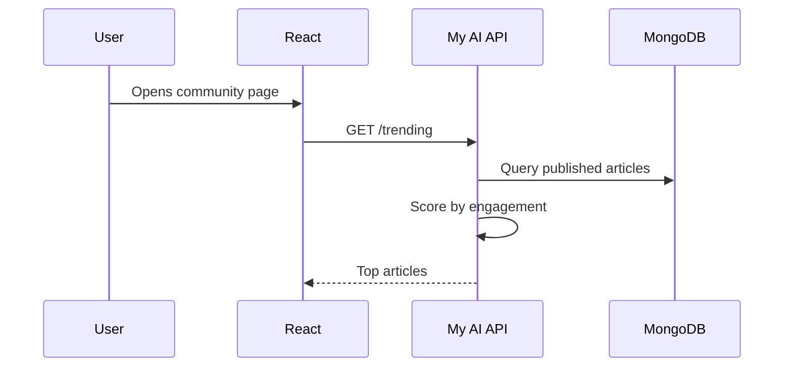
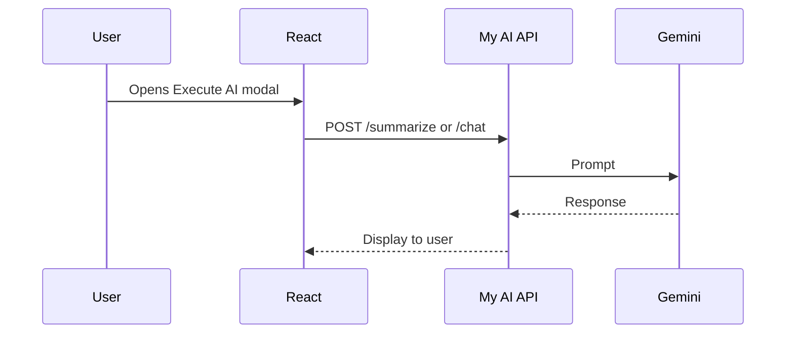
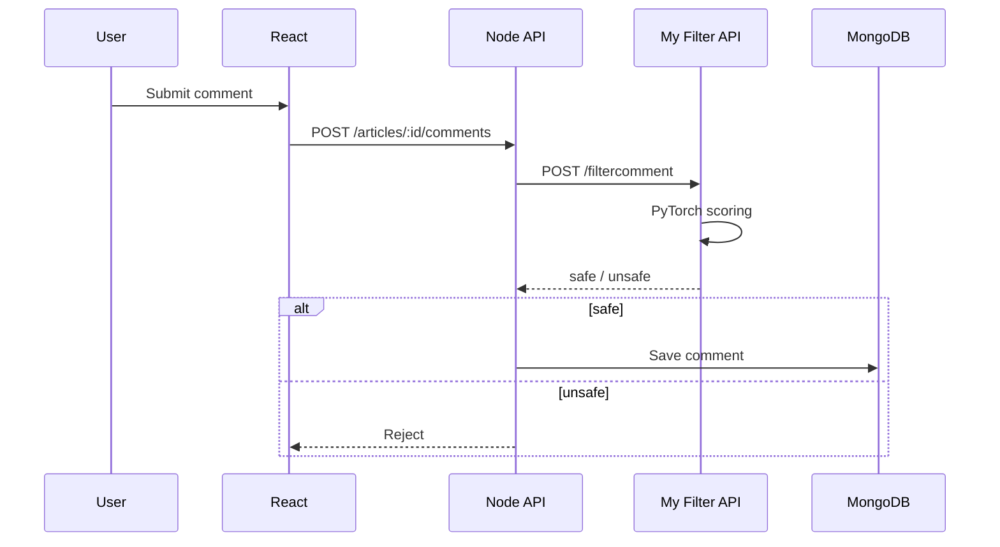

# How the full stack connects

When I joined the ExCom project, AI features were spread across six separate Python services on Render. I unified the Gemini work into one FastAPI app and kept moderation in its own Docker service. This document explains how my services integrate with the production frontend and Node backend.

**Live app:** [executepartners.com/community](https://www.executepartners.com/community)

---

## The four production services

| Service | URL | My involvement |
|---------|-----|----------------|
| React frontend | [executepartners.com/community](https://www.executepartners.com/community) | Integrated AI calls via env-based URLs |
| Node API | [ep-node-api.onrender.com](https://ep-node-api.onrender.com) | Calls my filter on every article/comment |
| **AI API** | [ep-ai-api.onrender.com](https://ep-ai-api.onrender.com) | **Built & maintained — in this repo** |
| **Filter API** | [ep-ai-filter.onrender.com](https://ep-ai-filter.onrender.com) | **Built & maintained — in this repo** |

---

## Environment wiring

The React app uses two backend URLs:

```env
VITE_API_URL=https://ep-node-api.onrender.com
VITE_AI_API_URL=https://ep-ai-api.onrender.com
```

Node calls my filter server-side:

```env
FILTER_API_URL=https://ep-ai-filter.onrender.com
```

I chose this split deliberately: Gemini calls go directly from the browser to my AI API for speed, while moderation always passes through Node so nothing toxic gets saved without a filter check.

---

## Request flows

### Trending topics



I compute trending scores from likes, comments, shares, and views stored in MongoDB.

### Execute AI (summarize & chat)



### Comment moderation (server-side)



This was important to me — moderation never runs in the browser. Node proxies every piece of user-generated content through my filter before it hits the database.

---

## Key files in this repo

| Feature | My code |
|---------|---------|
| All Gemini endpoints | `ai/main.py` |
| Article writing workflow | `ai/chatbot_logic.py` |
| Prompt templates | `ai/prompts.py`, `ai/session_prompts.py` |
| Filter API | `filter/api.py` |
| ML scoring | `filter/services/text_filter.py` |
| Model loading | `filter/model_loader.py` |

Frontend integration lives in the production React codebase (`ExecuteAIModal`, `TrendingTpoics`, `ArticleFormModal`). Node's filter proxy is in `filterService.js` on the backend repo.

---

## Running my services locally

```bash
cp .env.example .env   # add GOOGLE_API_KEY
docker compose up --build
```

- AI Swagger: http://localhost:8000/docs  
- Filter health: http://localhost:7860/health  

To see the full UX, use the [live community app](https://www.executepartners.com/community) — it already points at production APIs.
